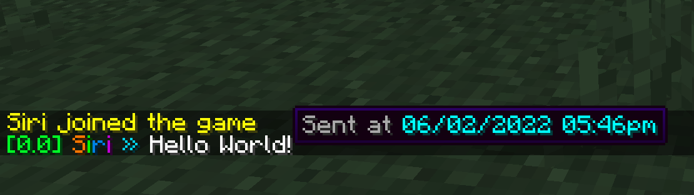

# ChitChat
A lightweight, simple-to-use chat plugin for Spigot and Paper Minecraft Servers - that supports 1.16+ hex-based styling, tooltips, click commands and much more.

This plugin is **heavily** inspired by [DeluxeChat](https://www.spigotmc.org/resources/deluxechat.1277/), and was built due DeluxeChat becoming abandoned (in its current state). This plugin was built as a plug-and-play solution to DeluxeChat, due to this, the configuration file is near identical until DeluxeChat gets updated.

This plugin was built in a day as a fun, one-off project, and so features like Bungeecord support doesn't currently exist. Feel free to do a pull request if you wish to add these features, as I currently do not have the time to do so.

---

### Commands:
- /chitchat - Overall Usage
- /chitchat reload - Reload Config
- /chitchat formats - List Formats

---

### Features:
- [x] HEX Support
- [x] Priority-based Formats
- [x] PlaceholderAPI Support
- [ ] Cross-Server Chat (BungeeCord)
- [ ] Private Messaging
- [ ] Social Spy

---

### Format Structure:
```yml
formats:
  default: # The identifier. (Permission: `chatformat.<identifier>`)
    priority: 2147483647 # Lower = More Priority

    # Channel styling:
    channel: '[%player_exp%] '
    channel_tooltip:
      - '&c%player_name%s &7current experience.'
    channel_click_command: /xp

    # Prefix styling:
    prefix: '%vault_prefix%'
    prefix_tooltip:
      - "&7This is a rank."
    prefix_click_command: '/buy'

    # Name styling:
    name: '<rainbow>%player_name%</rainbow>'
    name_tooltip:
      - '&7-=[&6✦&7]=-  &7-=[&e%player_name%&7]=-  &7-=[&6✦&7]=-'
      - '&5Sent: &f%player_timestamp%'
    name_click_command: '/profile %player_name%'

    # Suffix styling:
    suffix: ' <#22d3ee>» '
    suffix_tooltip: []
    suffix_click_command: ''

    # Chat styling:
    chat: '&f%message%'
    chat_tooltip: []
    chat_click_command: ''
```